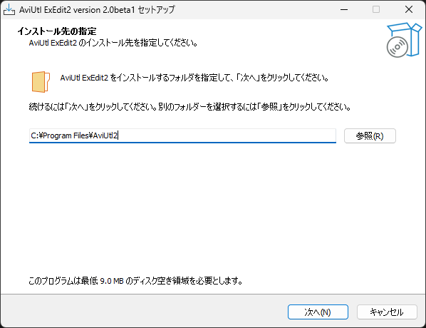
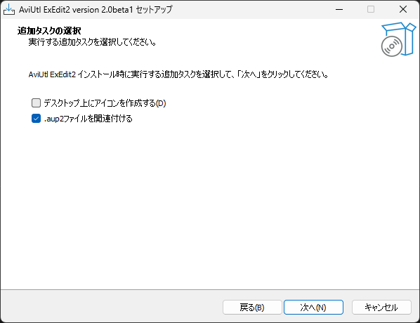
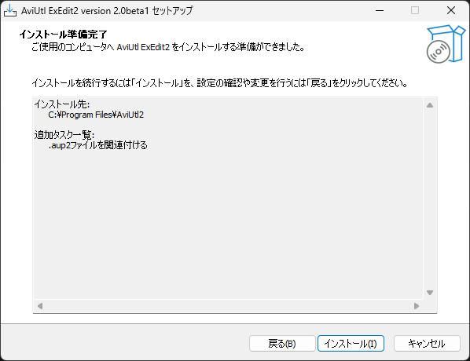
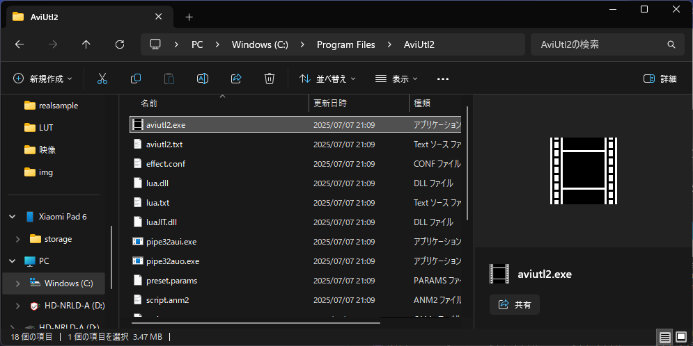

## ダウンロード

    

まずは、[AviUtlの公式サイト](https://spring-fragrance.mints.ne.jp/aviutl/)からAviUtl2をダウンロードします。ここではインストーラ版の導入方法を説明します。

## インストール
ダウンロードをした後、インストーラをダブルクリックします。
  
インストーラが起動したら、インストール先のフォルダを選択します。デフォルトでは`C:\Program Files\AviUtl2`にインストールされます。 インストール先を選択したら、「次へ」をクリックします。

    

 
次に、デスクトップにショートカットを作成するかどうかなどのオプションを選択します。必要に応じてチェックを入れ、「次へ」をクリックします。

    

 
最後に、インストール内容を確認し、「インストール」をクリックします。インストールが完了すると、完了画面が表示されます。「完了」をクリックしてインストーラを閉じます。

    

## 起動
インストール先のフォルダを開き、aviutl2.exeを起動します。適宜ショートカット等を作成しておくと便利です。 

    

